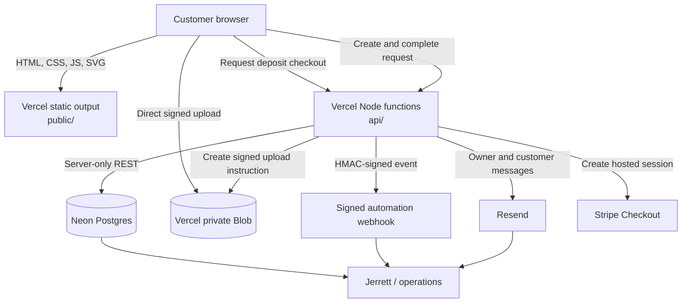

# Architecture

The separate homepage inquiry API and its private-upload, ownership, and notification contract are documented in [QUICK-INQUIRY.md](QUICK-INQUIRY.md).

## Goals

The implementation optimizes for a fast public site, low operating cost, few dependencies, secure handling of customer files, and clear seams for hosted services. It intentionally avoids making a large client framework a prerequisite for a small-service storefront.

## System context



## Static application

The `public/` directory is the entire deployable web surface.

### `assets/js/config.js`

Holds business-facing configuration: contact information, upload limits, profile links, default currency, and all quote rates. It contains no secrets.

### `assets/js/quote-engine.js`

Provides deterministic estimate functions and request-summary construction. It has no network dependency, which makes the estimate inspectable, testable, and available before a backend is connected.

### `assets/js/site.js`

Renders the shared header and footer, applies system/light/dark theme behavior, manages mobile navigation, and provides common interaction behavior. Theme controls remain usable for the current visit when browser storage is denied.

### `assets/js/order.js`

Owns the intake state machine, conditional fields, draft persistence, file validation, estimate updates, review rendering, API orchestration, local fallback, mailto handoff, JSON export, and optional deposit flow.

### `assets/css/site.css`

Contains service-page and builder layouts, responsive behavior, and illustration styling. The homepage and inquiry layouts live in `assets/evolution/evolution.css`.

### `assets/css/shared.css`

Loaded last on all eight public pages. Owns the shared blue/teal theme tokens, typography, content widths, buttons, navigation, footer, focus treatment, and responsive chrome. Both layout stylesheets consume these tokens. Every page mounts the same header and footer through `site.js`; the homepage imports that module before initializing its gallery and inquiry dialogs. The shared inquiry CTA opens the homepage dialog directly or links to `/?ask=unknown` from another route. Detailed service-specific builder links remain available. There are no remote fonts or stylesheets.

### Cached assets and release consistency

`npm run assets:version` derives one release key from public HTML, CSS, and JavaScript, then stamps stylesheet/script URLs and every local module import with `?v=<key>`. This prevents returning browsers from combining new markup with cached modules from an older release. The key is deterministic across platforms and changes when markup or any dependency changes. Vercel builds generate it automatically; local public-source edits must run `npm run assets:version` before `npm test`. Validation rejects stale keys. Keep prior query keys out of the hash input so repeated builds are idempotent.

The real-HTTP cached-upgrade browser test primes old unversioned assets, serves the current pages into the same browser cache, and verifies theme preference changes, manual overrides, dialog/menu actions, and all builder paths. Inline-rendered tests alone cannot detect this failure mode.

## Server functions

### `POST /api/request`

1. Enforces method and JSON size limits.
2. Applies the honeypot behavior.
3. Normalizes and validates the complete project request.
4. Generates a non-sequential request ID.
5. Creates a Supabase draft row when configured.
6. Returns the active integration mode.

A complete payload is validated before the initial row is created. This prevents anonymous clients from reserving empty records or arbitrary upload namespaces.

### `POST /api/upload-url`

1. Requires configured Neon and private Vercel Blob storage (or the legacy Supabase adapter).
2. Validates request ID, filename, extension, and size.
3. Confirms the request exists and is still in the draft state.
4. Creates a random object name beneath the request namespace.
5. Returns a non-overwriting signed upload URL.

The file body does not pass through the Node function. The browser uploads directly to private storage, reducing serverless memory, timeout, and bandwidth pressure.

### `PATCH /api/request`

1. Revalidates the request and uploaded file metadata.
2. Atomically marks one draft database record submitted and refuses missing or already-completed requests.
3. Writes a local NDJSON event only in local development.
4. Attempts owner/customer email and webhook delivery. Owner and customer email outcomes are tracked separately; a failed customer receipt does not erase a successful owner notification.
5. Returns per-integration results without exposing provider details.

Email or webhook failure does not erase a successfully persisted database request.

### `POST /api/checkout`

Creates a Stripe-hosted Checkout Session for the configured deposit and stores the request ID in Checkout and PaymentIntent metadata. It validates the email, request ID, title, and a 24-hour HMAC completion token issued only after a live request was persisted or delivered. The configured deposit amount is bounded server-side. A well-formed but unsubmitted request ID cannot create a Checkout Session.

### `GET /api/health`

Reports application version and whether Neon, private files, legacy Supabase, email, webhook, and Stripe variables are configured. It does not test provider credentials or reveal their values.

## Data model

The migration creates one operational table:

```text
service_requests
  id                text primary key
  status            constrained workflow value
  service           print | design | repair | consult
  project_title     text
  contact_name      text
  contact_email     text
  payload           normalized request JSON
  uploaded_files    normalized file metadata JSON
  created_at        timestamp
  submitted_at      timestamp
  updated_at        trigger-maintained timestamp
```

Neon is accessed only by the server-side database credential; the browser has no database connection. The legacy Supabase schema enables Row Level Security with no anonymous or authenticated policies.

The private Vercel Blob store holds objects as:

```text
<request-id>/<random-prefix>-<sanitized-filename>
```

The random prefix avoids collisions and discourages path guessing. The original safe filename remains visible to the owner. The legacy Supabase bucket defaults to `service-files`.

## Request contract

A completed normalized request has these conceptual fields:

```json
{
  "projectTitle": "Custom electronics enclosure",
  "service": "design",
  "serviceLabel": "Design something for me",
  "description": "...",
  "modelUrl": "https://...",
  "deadline": "2026-09-18",
  "estimate": {
    "low": 340,
    "high": 665,
    "formatted": "$340–$665",
    "currency": "USD",
    "confidence": "rough",
    "breakdown": {}
  },
  "specifications": {},
  "contact": {
    "name": "Customer",
    "email": "customer@example.com",
    "phone": null,
    "preferredContact": "email",
    "address": null
  },
  "files": [],
  "consent": true,
  "source": "3dprint4.me"
}
```

The browser payload is only a proposal. `lib/validation.js` produces the accepted server representation and bounds every reusable field. `specifications` contains the selected service's details and handoff choice; the file input and fields already represented at the request or contact level are excluded.

## Integration modes

### Local/preview

The browser catches an unavailable API and creates a `LOCAL-...` reference. It does not submit that local reference to the completion API, even if the server becomes reachable again. The request is retained in local storage when available, and the customer can open an email draft or download JSON. If browser storage refuses writes, the draft warning remains visible while editing and the finished request stays available in memory for immediate email or download. An HTTP 4xx rejection keeps the form open for correction instead of claiming a local submission. The optional deposit action is hidden when delivery was not confirmed.

When the included Node development server is running with `LOCAL_DEV=1`, valid request events also append to `data/dev-requests.ndjson`.

### Delivery only

Resend and/or a webhook can be used without Supabase. Request details are delivered, but selected files cannot be uploaded privately. The email/JSON handoff tells the customer to attach files separately.

### Full intake

Supabase persists records and enables signed uploads. Resend and webhook delivery remain optional but are recommended for operational awareness.

### Deposit

Stripe adds a hosted deposit action after submission. Deposit state is not currently synchronized back into `service_requests`; that requires a verified Stripe webhook and a deliberate payment/status model.

## Security boundaries

- The browser never receives the Supabase service-role key, Resend key, webhook secret, or Stripe secret.
- The signed upload URL grants only short-lived permission to one generated object path.
- Storage is private and owner email links are signed for 15 minutes.
- Allowed extensions, maximum files, and maximum file size are enforced in both browser and API paths where applicable.
- File names are normalized to a conservative character set.
- URLs accept only HTTP and HTTPS.
- API request bodies are bounded before parsing.
- Provider failures log status codes, without raw response bodies, and return generic 5xx responses.
- The webhook body can be authenticated with `X-3DP-Signature: sha256=<hex>`.
- Public headers restrict script sources, embedding, browser capabilities, referrers, and cross-origin behavior.

## Failure behavior

| Failure | Customer behavior | Operational behavior |
|---|---|---|
| Static-only hosting | Request remains locally recoverable | No server delivery |
| Supabase unavailable during create | Browser falls back locally | Error is logged by the function/platform |
| One file upload fails | Submission stops with the affected filename | Draft row may remain for cleanup |
| Database completes, email fails | Customer sees successful persisted request | Integration result records email failure in server logs |
| Webhook fails | Other integrations continue | HTTP status is logged |
| Stripe unavailable | Request remains complete; deposit action errors visibly | No effect on request record |

## Extension points

### Admin application

Build a separate authenticated application in Blazor/MudBlazor, Next.js, or another preferred stack. Read `service_requests` using authenticated server credentials and preserve the table/status contract.

### Quote workflow

Add tables for `quotes`, `quote_items`, `messages`, and `status_events`. Generate customer-facing approval links with high-entropy, expiring tokens rather than exposing internal IDs alone.

### Payment reconciliation

Add `/api/stripe-webhook`, verify the raw-body signature, record event IDs idempotently, and map payment state to a separate payment entity. Do not infer fulfillment approval only from a browser success redirect.

### Product catalog

Keep custom projects in the current request flow. Add a catalog adapter for fixed, repeatable SKUs, then route checkout through Shopify or Stripe according to inventory, tax, shipping, and marketplace needs.

### Larger uploads

The delivered 25 MB limit suits common model and reference files. For significantly larger files, add a resumable protocol and explicit cleanup lifecycle rather than increasing server/API payload limits.

## Architectural decisions

| Decision | Rationale | Cost |
|---|---|---|
| Static-first public UI | Fast, cheap, durable, and easy to inspect | Repeated HTML shells are managed through shared JS rather than server rendering |
| Vanilla ES modules | No build chain or client package exposure | Fewer off-the-shelf component abstractions |
| Serverless adapter layer | Secrets and provider calls stay off the client | Long-running work needs a queue or worker later |
| Direct signed uploads | Avoids proxying binaries through functions | Requires storage CORS and careful signed-path handling |
| JSON payload plus indexed columns | Flexible early-stage intake with practical search fields | Mature reporting may need normalized child tables |
| Rough range calculator | Honest about uncertainty and improves intake quality | Human review remains operationally necessary |
| Separate admin later | Public surface stays small and unauthenticated | Back-office UI is not part of this first repository |
