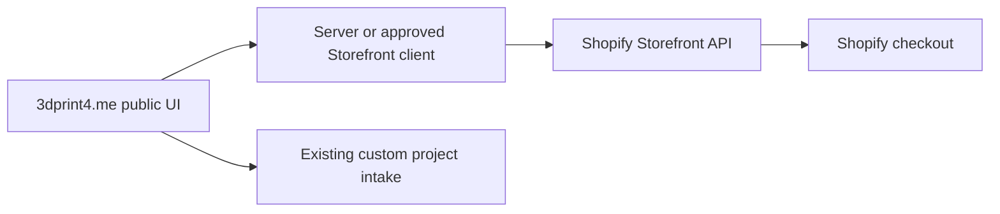

# Commerce Options

## Recommendation

Launch custom services through the delivered request and human-quote flow. Add fixed-product commerce only when an item has a stable design, license, material, color options, production time, packaging method, shipping profile, return policy, and capacity rule.

Custom design, repair, and one-off printing do not fit a conventional cart well because the price and acceptability depend on information that arrives with the customer request.

## Delivered path: request plus optional deposit

The current implementation supports:

- Guided scope capture
- Rough planning estimate
- Private files
- Human confirmation
- Optional Stripe-hosted fixed deposit
- Request ID in Stripe metadata
- Short-lived completion proof before checkout is created

This is the lowest-friction starting point for a service business. It separates inquiry from acceptance and keeps the browser estimate from becoming an accidental binding checkout price.

### Production gap to close

Add a verified Stripe webhook before payment state automatically changes project status or reserves production capacity. Browser redirects are not payment verification.

## Shopify option 1: Buy Button

Best for a small number of repeatable products embedded into the existing site.

Use it when:

- Products are standard SKUs
- Shopify should own product data, inventory, tax, discount, checkout, and order records
- The public site should remain mostly unchanged

Suggested placement:

- Add `/shop.html`
- Load product components only on that page
- Keep custom-service calls to action routed to `/order.html`
- Label model license, material, size, production lead time, and color choices clearly

Tradeoffs:

- Fast to add
- Less control over deep cart behavior and visual details
- Introduces Shopify client scripts and requires CSP updates
- Custom project files and questions should stay outside the product cart

## Shopify option 2: Storefront API

Best when the site needs a fully custom product catalog and cart while Shopify remains the commerce system of record.

Use it when:

- Product filtering, bundles, customer accounts, or custom cart UI matter
- The site needs controlled integration with collections, products, variants, carts, and checkout
- There is enough catalog volume to justify API versioning and application maintenance

Recommended architecture:



Keep a supported API version pinned and update it on a scheduled cadence. Do not put Admin API credentials in the browser.

## SHOP.COM marketplace

Treat SHOP.COM as a product-distribution channel, not the operating backend for custom project intake.

Good candidates:

- Finished, repeatable physical products
- Clearly defined variants
- Predictable fulfillment and shipping
- Products with rights to sell at marketplace scale

Poor candidates:

- Open-ended repair
- Custom modeling
- Customer-uploaded one-off prints
- Jobs that require a human feasibility review before acceptance

Use the existing site as the brand and custom-service destination. Maintain marketplace listings and orders according to SHOP.COM's merchant onboarding and fulfillment processes.

## Stripe Payment Links versus Checkout Sessions

Payment Links are useful for manual quoting when a human creates a unique or reusable link after scope confirmation. The delivered Checkout Session adapter is better for the optional fixed deposit because it can attach request metadata programmatically.

For final balances, choose one consistent method:

- Invoice after the quote is approved
- Unique Checkout Session for the confirmed amount
- Accounting-platform invoice and payment link
- Shopify order for a fixed product

Do not create multiple unsynchronized payment records for the same balance.

## Supabase as an operations backend

Supabase is suitable for early request operations, files, status, internal notes, and customer status tokens. It is not a tax, accounting, inventory, or marketplace system by itself.

A future admin system can add:

- Quotes and line items
- Messages
- Status history
- Payment references
- Printer/capacity assignments
- Materials and inventory
- Shipping labels and tracking
- Customer-facing status links

Keep external provider IDs in dedicated columns/tables rather than embedding every state change only in the request JSON.

## Blazor and MudBlazor option

A Blazor/MudBlazor back-office application is a good fit for the owner's authenticated workflow without burdening the public site.

Suggested solution split:

```text
3dprint4me-public      this repository; static storefront and serverless intake
3dprint4me-ops         authenticated Blazor/MudBlazor application
3dprint4me-domain      optional shared contracts and workflow policies
```

The operations app can read Supabase through a server backend, receive the signed webhook, or use a separate Postgres connection. Avoid placing the Supabase service-role key in WebAssembly.

## Recommended sequence

1. Launch the custom-service intake with Supabase and email.
2. Establish pricing, file retention, quote, approval, and fulfillment habits.
3. Add Stripe webhook reconciliation if deposits are used.
4. Build a small operations dashboard after real request patterns are known.
5. Add fixed SKUs only for repeated work with stable margins.
6. Use Shopify Buy Button for a handful of SKUs, or Storefront API when catalog complexity justifies it.
7. Add marketplace channels such as SHOP.COM only for suitable repeatable products.
